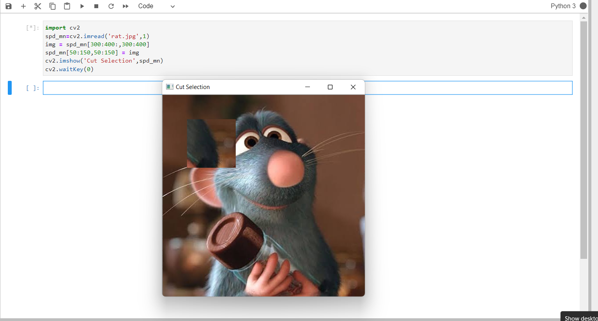

# READ AND WRITE AN IMAGE
## AIM
To write a python program using OpenCV to do the following image manipulations.
i) Read, display, and write an image.
ii) Access the rows and columns in an image.
iii) Cut and paste a small portion of the image.

## Software Required:
Anaconda - Python 3.7
## Algorithm:
### Step1:
Choose an image and save it as a filename.jpg
### Step2:
Use imread(filename, flags) to read the file.
### Step3:
Use imshow(window_name, image) to display the image.
### Step4:
Use imwrite(filename, image) to write the image.
### Step5:
End the program and close the output image windows.
## Program:
```python
# Developed By:DHANUSH S
# Register Number : 212221230020
i) #To Read,display the image

# Color
import cv2
spd_mn=cv2.imread('rat.jpg',1)
cv2.imshow('rat',spd_mn)
cv2.waitKey(0)
```
```
# Grayscale

import cv2
spd_mn=cv2.imread('rat.jpg',0)
cv2.imshow('Grayscale',spd_mn)
cv2.waitKey(0)

```
ii) #To write the image
```
import cv2
spd_mn=cv2.imread('rat.jpg',1)
cv2.imwrite('rat.jpg',spd_mn)

```
iii) #Find the shape of the Image
```
import cv2
spd_mn=cv2.imread('rat.jpg',1)
print(spd_mn.shape)

```
iv) #To access rows and columns
```
import cv2
spd_mn=cv2.imread('rat.jpg',1)
import random
for i in range(200):
    for j in range(spd_mn.shape[1]):
        spd_mn[i][j] = [random.randint(0,100),random.randint(0,100),random.randint(0,100)]
cv2.imshow('rat',spd_mn)
cv2.waitKey(0)
```
v) #To cut and paste portion of image
```
import cv2
spd_mn=cv2.imread('rat.jpg',1)
img = spd_mn[300:400:,300:400]
spd_mn[50:150,50:150] = img
cv2.imshow('Cut Selection',spd_mn)
cv2.waitKey(0)
```
## Output:

### i) Read and display the image
<br>
<br>
### ii)Write the image
<br>
<br>

### iii)Shape of the Image
<br>
### iv)Access rows and columns
<br>
### v)Cut and paste portion of image
<br>
## Result:
Thus the images are read, displayed, and written successfully using the python program.


